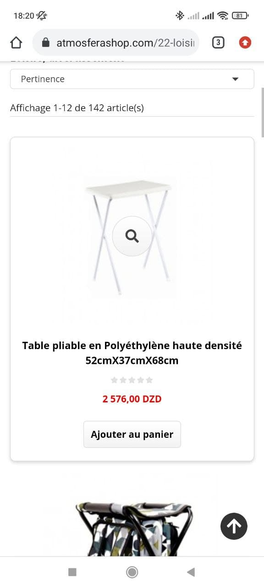

# benhicham.github.io
<!DOCTYPE html>

<html>

<head>
	<meta charset="utf-8">
	<title>Benzatout Hichem</title>
	<!--CSS-->
	<meta name="viewport" content="width=device-width, initial-scale=1">
	<link href="https://cdn.jsdelivr.net/npm/bootstrap@5.1.3/dist/css/bootstrap.min.css" rel="stylesheet"
		integrity="sha384-1BmE4kWBq78iYhFldvKuhfTAU6auU8tT94WrHftjDbrCEXSU1oBoqyl2QvZ6jIW3" crossorigin="anonymous">
	<!--main css-->
	<link rel="stylesheet" href="CSS/main.css">
	<!--owl css-->
	<link rel="stylesheet" href="CSS/owl.carousel.min.css">
	<link rel="stylesheet" href="CSS/owl.theme.default.min.css">
	<!--fonts-->
	

	
	

	
	
</head>

<body>

	<!--navbar-->

	<nav class="navbar  navbar-expand-lg navbar-light " style="background-color: #659dbd;">
		

			<a class="navbar-brand" href="#">
				en's
			</a>
			<button class="navbar-toggler" type="button" data-bs-toggle="collapse"
				data-bs-target="#navbarSupportedContent" aria-controls="navbarSupportedContent" aria-expanded="false"
				aria-label="Toggle navigation">
				
			</button>
			

				<ul class="navbar-nav mx-auto">
					<li class="nav-item">
						<a class="nav-link active" aria-current="page" href="#descme">Home</a>
					</li>
					<li class="nav-item">
						<a class="nav-link" href="#skillz">My Skills</a>
					</li>
					<li class="nav-item">
						<a class="nav-link" href="#portfo">Portfolio</a>
					</li>
					<li class="nav-item">
						<a class="nav-link" href="#contact">Contact </a>
					</li>

				</ul>

			

		

	</nav>

	<!--navbar-->

	<!--Heder-->

	

		

			

				<h1 class="int">
					

						
					

					
designer, developper, innovtor

				</h1>
			

		

	

	<!--Heder-->

	<!--ME-->

	

		

			

				

			

			

				<h1 class="display-6">I AM BENZATOUT HICHEM</h1>
				

					I'm a web developper, i have a master degree in web technologies, i've worked in this field since
					2018, worked on many projects(website, e-commerce, web apps,...etc).
				

			

		

	

	<!--ME-->

	<!--My skills-->

	<!--My skills-->

	

		PROFESSIONL SKILL

	

	

		

			

				HTML
				

					
80%

				

			

			

				CSS
				

					
75%

				

			

			

				JavaScript
				

					
65%

				

			

			

				PHP
				

					
50%

				

			

			

				JavaScript
				

					
65%

				

			

			

				React
				

					
45%

				

			

			

				Nodejs
				

					
45%

				

			

			

				Bootstrap
				

					
70%

				

			

			

				Laraval
				

					
60%

				

			

			

				Android
				

					
50%

				

			

			

				Flutter
				

					
55%

				

			

		

	

	

		Education & Certificate

	

	

		

			<h3>Bachelor degree</h3>
			<h6>2012-2016</h6>
			
In this periode i got my bachelor degree in <strong> <mark>information systems </mark></strong>

		

		

			<h3>Master degree</h3>
			<h6>2016-2018</h6>
			
I have a master degree in <strong> <mark>Web developemnt and web technologies</mark></strong>>, in this 2
				years i"ve learned lot about my fields and worked on so many projets that helped me to gain more
				expertize in this field.

		

		

			<h3>Google IT Support
				Professional Certificate</h3>
			<h6>2019</h6>
			
 In this program, i've learned the fundamentals of operating systems and networking, and how to
				troubleshoot problems using code to ensure computers run correctly.

		

		

			<h3>Cisco CCNAv7</h3>
			<h6>2020-2021</h6>
			
In this program, i've learned the basic about routing and switching different networks.Also i've learned
				some basics about securing networks using Cisco commandes and algorithms.

		

	

	

		

			

				<h1 class="gallery-title">PORTFOLIO</h1>
			

			

				<button class="btn btn-default filter-button" data-filter="all">All</button>
				<button class="btn btn-default filter-button" data-filter="websites">Websites</button>
				<button class="btn btn-default filter-button" data-filter="apps">Apps</button>

			

			 

			

				
			

			

				
			

			

				
			

			

				
			

			

				
			

			

				
			

			

				
			

			

				
			

			

				
			

			

				
			

			

				
			

			

				
			

			

				
			

			

				
			

			

				
			

			

				
			

			<!-- Contact-->

			

				<h2 id="contact" class="ms-4 mb-5">GET IN TOUCH</h2>

			

			

				

					

						

						<ul class="fa-ul" id="list">
							<li><i class="fa fa-map-marker" aria-hidden="true"></i> Es-senia-Oran-Algeria</li>
							<li><i class="fa fa-volume-control-phone" aria-hidden="true"></i> 0799-19-08-14</li>
							<li><i class="fa fa-envelope" aria-hidden="true"></i> hichamben321@gmail.com</li>

						</ul>

					

					

						<form id="contact-form" >
							

								<label for="name" class="form-labl"> Enter your name </label>
								<input type="text" class="form-control" id="name" name="name" required>
								

								

									<label for="email" class="form-label">Email</label>
									<input type="email" class="form-control" id="email" name="email" required>
									

								

								

									<label for="subject" class="form-label">subject</label>
									<input type="text" class="form-control" id="subject" name="subject" required>
									

								

								

									<label for="message" class="form-label">Message</label>
									<textarea name="message" id="message" cols="30" rows="10" class="form-control"
										required>
            </textarea>
									

								

								
<input type="submit" name="submit" class="btn btn-primary" value="send-message"
										onclick="validateForm();">

								

							

						</form>

					

				

			

			<!--end contact-->

			<!--footer-->
			<section id="footer">
				

					

						

							<ul class="unstyled-list">
								<li>
									<a href="https://www.facebook.com/hicham.btox/"><i class="fa-brands fa-facebook-f"></i></a>
								</li>
								<li>
									<a href="https://www.instagram.com/hichambtox/?hl=fr"><i class="fa-brands fa-instagram"></i></a>
								</li>
								<li>
									<a href="https://www.linkedin.com/in/hichem-benzatout-7b58b0190/"><i class="fa-brands fa-linkedin"></i></i></a>
								</li>
								<li>
									<a href="https://github.com/benben1010?tab=repositories"><i class="fa-brands fa-github"></i></i></a>
								</li>

							</ul>

						

						
 &copy; Copyright benzatout hichem. All
							right are reserved

					

				

			</section>

			<!--endfooter-->

		

	

	

	<!-- filter button gallery-->

	

	<!--type effect-->

	

	<!-- owl carrousel-->

	

</body>

</html>
